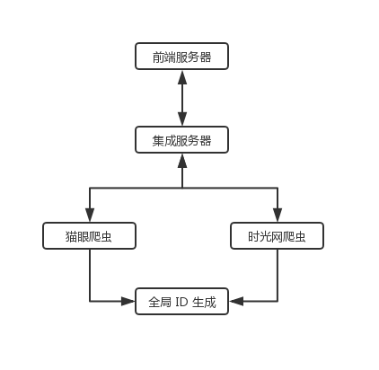
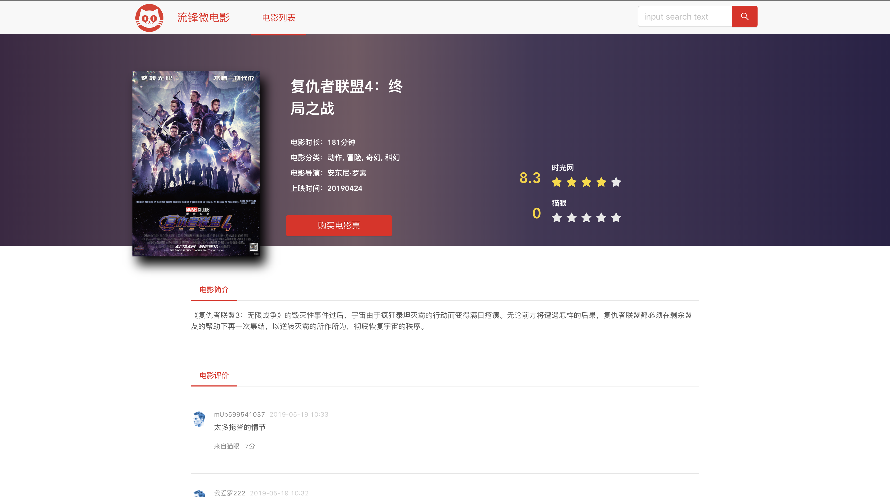
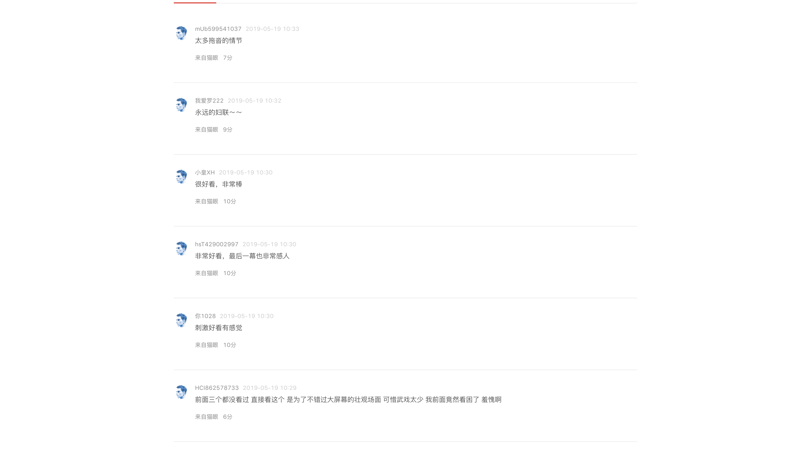
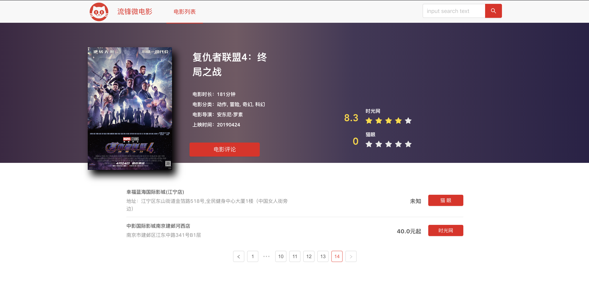

# 应用集成大作业

<div style="width: 100%; text-align: center; font-size: 24px; line-height: 32px;">
  <div style="margin: 10px;">陈骁 161250014<div/>
  <div style="margin: 10px;">廖均达 161250068<div/>
  <div style="margin: 10px;">訾源 161250220</div>
</div>


[TOC]


## 1. 项目介绍

“流锋微电影”在线电影集成平台通过收集国内主流的电影销售平台的数据，对于不同电影网站的数据进行统一集成，并提供可视化展示功能。用户可以通过本平台了解电影的基本信息、评论信息和影院信息。


## 2. 数据源

本项目考虑到数据的质量和可靠性，选择了猫眼和时光网两家权威的国内电影售票网站的数据进行集成，具体的数据源如下所示。

| 数据源 | 网址                                           |
| ------ | ---------------------------------------------- |
| 猫眼   | https://maoyan.com/                            |
| 时光网 | http://www.mtime.com/ |


## 3. 架构



项目架构如图所示。

本项目采用微服务架构，由多个进程构成，具体如上图所示。

- 前端采用 Vue 编写，和集成服务器交互，用于显示数据。

- 集成服务器采用 Java 编写，集成服务器从猫眼爬虫和时光网爬虫获取数据，并对两个格式不同和含义不同的数据源进行集成，将其转化为通用的数据格式。

- 猫眼爬虫使用 Go 编写，从猫眼爬取电影、评论以及影院等信息。

- 时光网爬虫使用 Python 编写，从现有的时光网 api 获取电影、评论以及影院等信息。

- 全局 ID 生成使用 Go 语言编写，为猫眼爬虫和时光网爬虫提供全局的 ID 生成服务。


## 4. 运行

鉴于助教环境可能和本地开发环境有很大的差距，为了方便助教运行，因此我们将猫眼爬虫、时光网爬虫、全局 ID 生成模块打包成了 Docker 镜像，放在了 Docker Hub 上。

拉取方式：

```shell
docker pull iznauy/uuid:v1
docker pull iznauy/maoyan:v1
docker pull iznauy/mtime:v1
```

执行命令（依次执行）：

```shell
docker run --name uuid --rm -it -d -p 8888:8888 iznauy/uuid:v1
docker run --name maoyan --rm -it -d -p 8000:8000 --link uuid:uuid iznauy/maoyan:v1
docker run --name mtime --rm -it -d -p 5000:5000 --link uuid:uuid iznauy/mtime:v1 python app.py
```

当 Docker 全部启动好之后，启动集成服务器（Java Maven 项目，启动十分简单）以及前端服务器（使用 Vue 编写，启动非常简单）。

> 值得注意的是，猫眼爬虫采用启动时抓取数据 + 定期抓取数据的方式，所以刚启动的 1~2 分钟内，无法从猫眼中获取数据。时光网爬虫采用懒加载的方式，第一次访问URL时候，可能会超时，等待 1~2 分钟，抓取完所有数据后，之后的请求响应速度就正常了。

> 另外一点值得注意的是，由于近期南京大学爬时光网、猫眼的人较多，似乎猫眼和时光网会拒绝校园网的图片访问请求，可能会导致图片无法正常显示。


## 5. 集成过程

### 5.1 整体流程

1. 对于猫眼网站我们使用了爬虫对数据进行爬取，而对于时光网，我们采取了直接访问它的 api 的方式来获取数据，得到的数据由各个模块分别负责保存
2. 集成模块通过 http 协议分别获得"猫眼模块"和"时光网模块"爬取到的两个网站的电影数据，数据的格式是 Json 字符串
3. 集成模块对 Json 字符串进行解析，转换成统一的 Java 类，
4. 前端模块通过 http 协议访问集成模块，集成模块将统一的 Java 类转换成 Json 字符串后返回给前端
5. 前端解析 Json 字符串后将数据进行展示


### 5.2 集成内容

- 电影简介信息
- 电影详细信息
- 每部电影购票的影院信息
- 每部电影的评论信息


### 5.3 数据格式

#### 5.3.1 电影列表项

```json
{
    "categories": [
      "动作",
      "冒险",
      "喜剧"
    ],
    "global_id": 0,
    "img": "http://img5.mtime.cn/mt/2019/05/06/105806.73235069_1280X720X2.jpg",
    "length": "104分钟",
    "name": "大侦探皮卡丘",
    "score": "7.1"
}
```

#### 5.3.2 电影详细信息

```json
{
    "categories": [
        "动作",
        "冒险",
        "奇幻",
        "科幻"
    ],
    "description": "《复仇者联盟3：无限战争》的毁灭性事件过后，宇宙由于疯狂泰坦灭霸的行动而变得满目疮痍。无论前方将遭遇怎样的后果，复仇者联盟都必须在剩余盟友的帮助下再一次集结，以逆转灭霸的所作所为，彻底恢复宇宙的秩序。",
    "directors": "安东尼·罗素",
    "en_name": "Avengers: Endgame",
    "global_id": 1,
    "has_scored": true,
    "img": "http://img5.mtime.cn/mt/2019/03/29/095608.66203322_1280X720X2.jpg",
    "length": "181分钟",
    "name": "复仇者联盟4：终局之战",
    "release_date": "20190424",
    "score": 8.3,
    "score_count": 321,
    "ticket_office": "41.05"
}
```

#### 5.3.3 影院信息

```json
{
    "movie_gid": 1,
    "name": "南京金逸（玉桥店）",
    "position": "南京市鼓楼区建宁路8号玉桥商业广场三期9楼",
    "price": 29,
    "url": "https://m.mtime.cn/#!/theater/628/4273/date/20190519/movie/218090/"
}
```

#### 5.3.4 评论信息

```json
{
    "content": "在零点场看完《复仇者联盟4》之后，跟随着观众群慢慢往影院外走。快靠近电梯的时候，一位挑染着蓝色头发的女孩靠着墙壁哭泣。\n这吸引了不少人的注意，但她并不在意人们的目光，靠在那里，时不时用手揩一下眼泪。没有人真正知道她落泪的原因，但在这样一个凌晨时分，所有看完《复仇者联盟4》的观众在看到这一幕时，都会觉得她大概是在为电影而落泪吧？\n\n\n这并不是不可能。对于喜爱漫威电影的影迷而言，尤其对于喜欢《复仇者联...",
    "movie_gid": 1,
    "score": 8,
    "time": "2019-04-24 20:31:00",
    "username": "happy木易"
}
```


## 6. 项目展示

**网站首页如下图所示：**


**点击某个电影之后，可以查看电影的导演、分类、时长、评分、介绍等详细信息：**




**向下划可以查看该电影的评论信息，评论来自猫眼和时光网：**




**点击"购买电影票"后切换到影院列表，显示南京所有当日播放该电影的影院，并显示响应的价格，点击按钮可以跳转到对应的购票网站：**




**如果一家影院同时可以在两个网站中找到，会集成影院信息，并提供不同的购买链接：**


